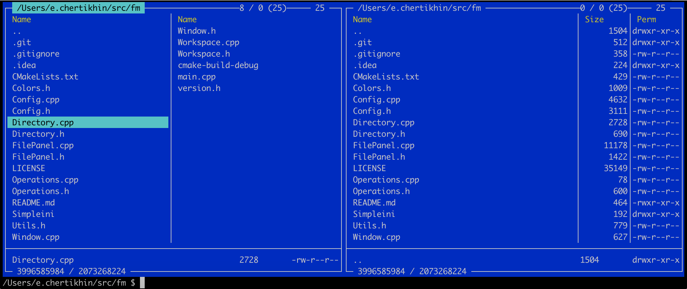

# File Manager 

This project innitiated because *Midnight commanger* become uncomfortable. Require too much dependencies, works differ in different platform and, probably stop development. But sometimes in some situations same tool are usefull. And yes, I use this tool to speed up some process.

So, welcome to File Manager ;)

It should be very lightweight application with minimal (probably zero) dependencies, easy to compile and easy porting to different unix-like systems. Microsoft windows also might be supported (sorry I have no one for test).

Another one things to start this development is refresh my c++ knoweledge.

Author: Eugene Chertikhin <e.chertikhin@crestwavetech.com>

Licensed under GNU GPL.
